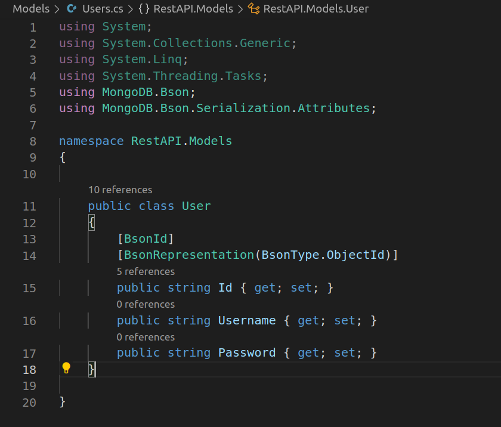
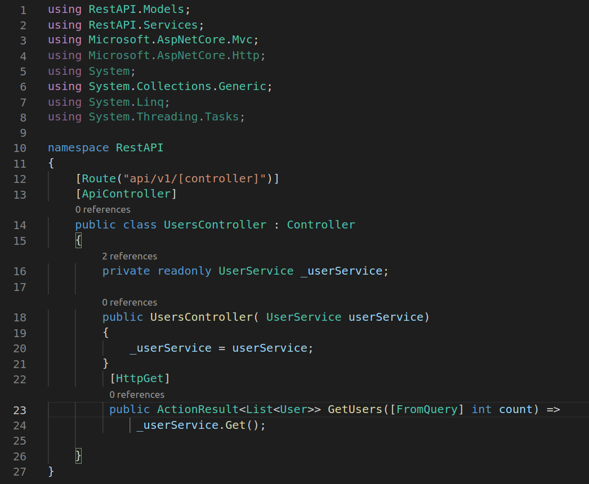
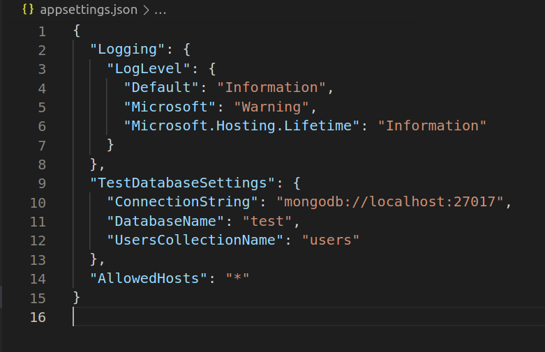
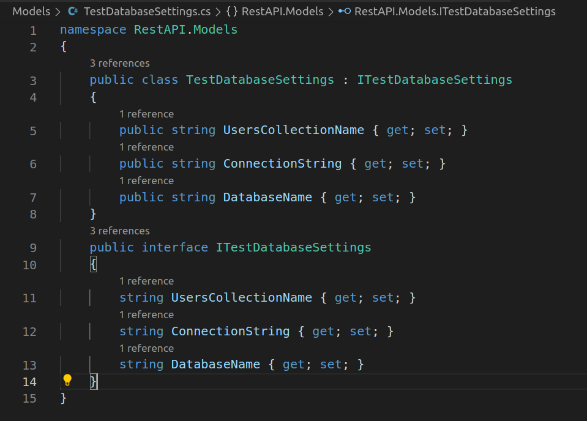
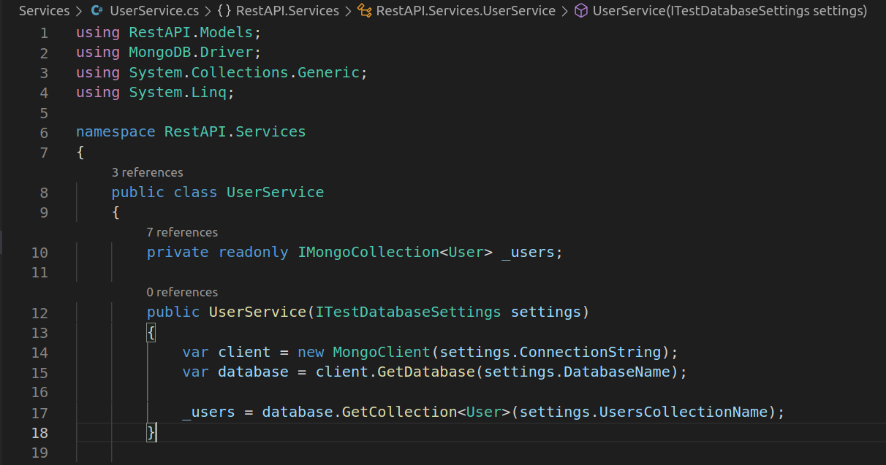
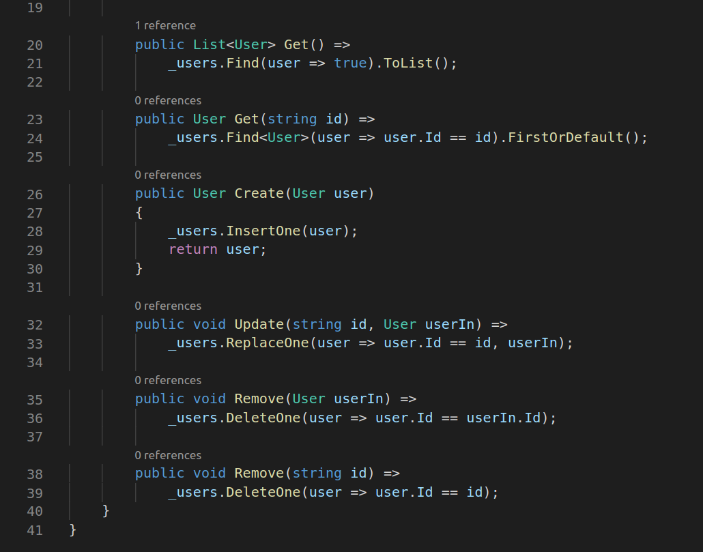
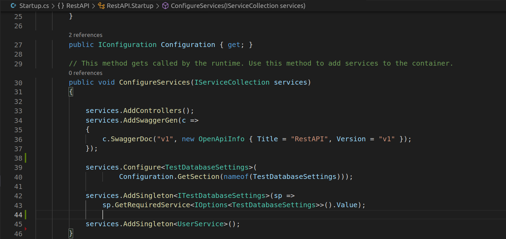

# RestAPI

## Description:

This is an example of a basic Rest API using MongoDB on the backend. Will implement OAuth2 next. Here are the steps I've taken.

## Directions

***
- *Create project in directory of your choice*
	- ` dotnet new webapi `
***
- *Create models for each table in database*
	- 
***
- Create associated controllers and routes
	- 
***
- *Connect database*
	- *In appsettings.json*
	
	- [ASP.NET >> MongoDB](https://docs.microsoft.com/en-us/aspnet/core/tutorials/first-mongo-app?view=aspnetcore-5.0&tabs=visual-studio)
***
- Create Service that connects to tables/collections in data store. (UserService)
	- *In models add a service for db settings*
	
***
- In Services folder add a service for each table/model in db
	- 
	
***
- *In startup.cs add to ConfigureServices method line 39-45* 
	- 
    ***